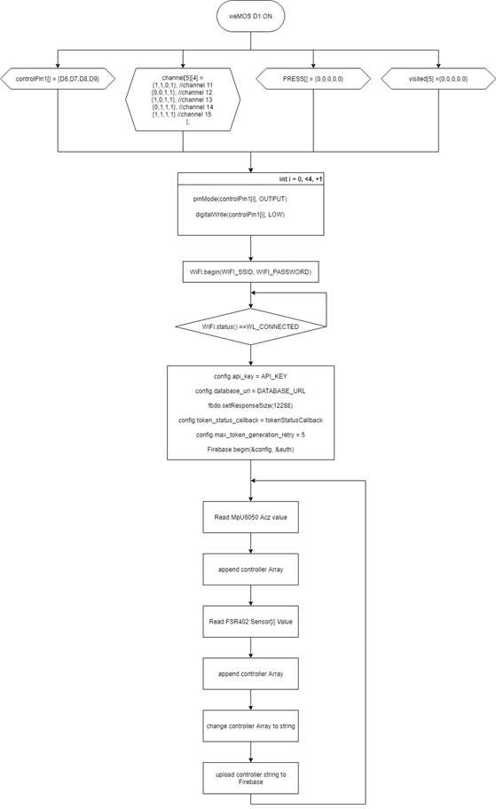
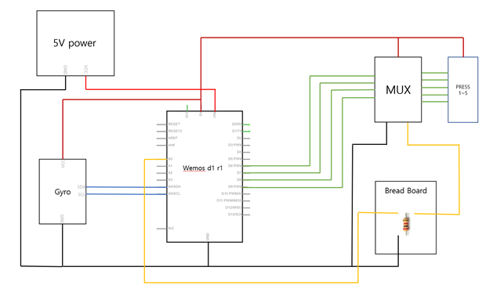

# controller

## FlowChart

 

## 회로도

 

## software 기능

- FSR402와 MPU6050 아날로그 값 수신 : for문을 사용해 FSR402 5개의 아날로그값을 빠르게 측정한 뒤 ‘controller’ 배열에 push 한다. push가 끝나면 바로 mpu6050의 아날로그값도 수신하여 ‘controller’ 배열에 push 한다.
- Firebase ‘controller/’ set : ‘controller’ 배열을 문자열로 변경한 뒤 ‘controller/’ 문서에 update한다.

 

## 하드웨어 기능

 wemosD1은 아날로그 핀이 하나밖에 없어서 압력센서를 직접 연결하면 컨트롤러에서만 5개의 MCU가 필요해진다. 그렇게 되면 사용하지 않는 디지털 핀이 너무 많으므로 불필요한 공간 차지가 발생한다. 
 
 따라서 하나의 아날로그 핀만으로 5개의 압력센서를 측정하기 위해서 멀티플렉서를 사용했다. 멀티플렉서는 4개의 컨트롤핀으로 16개의 핀에 전류를 흘려보낸 뒤 아날로그값을 수신할 수 있게 한다. 4개의 컨트롤핀은 HIGH 또는 LOW의 상태를 가질 수 있으므로 최종적으로 16개의 경우의 수를 만들어 낼 수 있기 때문에 출력 핀이 16개이며 따라서 0번 출력 핀은 컨트롤핀이 ‘0,0,0,0’일 때 선택되며 1번 핀은 ‘0,0,0,1’일 때 선택됨을 예측할 수 있다. 

 mpu6050은 자이로 가속도 센서로 I2C 시리얼 통신을 한다. I2C는 직렬 버스 통신으로 직렬데이터와 직렬 클럭 두 개의 양방향 오픈 컬렉터 라인을 사용하기 때문에 wemosD1의 SDA핀과 SCL핀에 연결해주면 되며, 모듈 내부에 풀업 저항을 연결해 입출력 전압 레벨이 다른 장치 간에도 통신이 가능하다. 