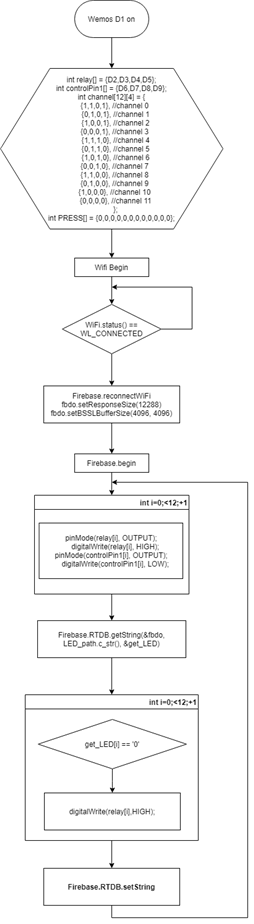
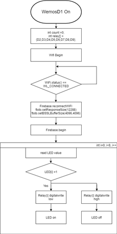
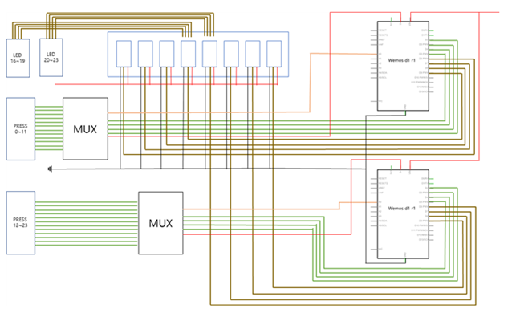
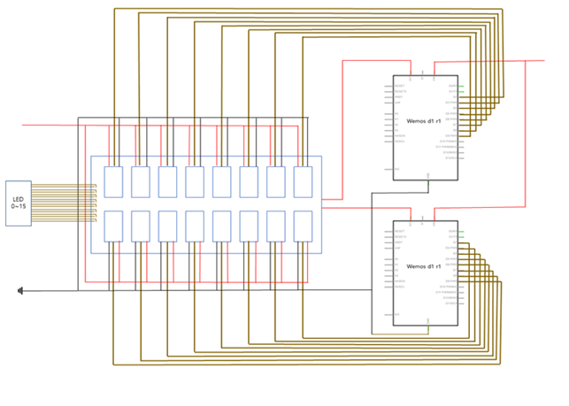

# SmartMat

## FlowChart

 

## 회로도

 

## software 기능

- LED 점등 : 웹에서 재활 부위와 난이도를 선택하면 그에 따라 on 또는 off 될 LED의 상태가 ‘/LED’ 문서에 문자열로 update된다. 매트의 wemosD1은 이 문서의 데이터를 읽어와서 각 인덱스가 어느 LED의 상태를 나타내는지 파악하여 릴레이를 제어한다.
- Firebase ‘press/’ set : LED와 같은 위치에 부착되어있는 압력센서 값을 컨트롤러와 같은 방식으로 읽어 들여 press 배열에 저장한다. 다시 이 배열을 press_string이라는 문자열로 변환한 뒤 firebase의 ‘press/’ 문서에 update한다.

 

## hardware 기능

4개의 FSR402를 제어하기 위해서 2개의 multipelexer를 사용했다. 4개의 컨트롤핀으로 16개의 output 핀에 전류를 공급하고 하나의 아날로그 값을 수신한다. 