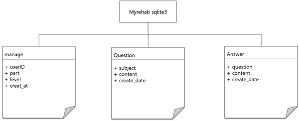

# MyRehab WEB

## 🦾 기능

  - 부위와 난이도 설정 
    - 부위와 난이도를 선택하면 선택정보를 서버에 POST방식으로 전송. 
    - 서버에서는 전송받은 부위와 난이도를 이름으로 갖는 머신러닝 모델을 불러와서 재활치료 페이지에 적용.
  - 매트 압력 시각화 
    - 재활치료를 진행 중인 사용자가 스마트매트에 가하는 압력을 측정하여 매트의 어느 위치에 압력이 가해지고 있는지 페이지의 css를 javascript로 변경해서 매트의 상태를 시각화해 보여줌.
  - 자세 교정 
    - 웹캠으로 사용자 동작 수행 이미지를 입력받아서 자세를 분석
    - 컨트롤러의 센서값과 스마트매트 센서값을 firebaseDB에서 읽어들인 후, 현재의 치료 동작에 부합하는 값인지 비교
    - 자세에 교정이 필요한 경우 음성 피드백 제공
  - 기록관리
    - 사용자 기록을 sqlite3 DB에 추가
  - 커뮤니티 
    - MyRehab 사용자들과 재활전문가들이 재활치료에 관한 정보를 공유할 수 있도록 질문과 답변을 form으로 전송받아 sqlite3 DB에 update하여 커뮤니티를 형성한다.
  - 게임 
    - firebaseDB의 ‘controller/’ 문서에 등록된 문자열 데이터를 READ
    - JSON.parse 함수를 사용해서 배열로 변경한 뒤 게임에 필요한 데이터가 포함된 인덱스의 값을 참조
    - 기울기를 사용한 자이로 게임이나 압력을 사용하는 리듬 게임에 적용 

## 🛢 DB 구조도


## 🗃 API 스펙

+ ```POST /manage/``` : 재활치료를 완료한 사용자ID, 부위, 난이도, DateTime을 받아서 DB에 저장
+ ```GET /rehab/``` : 치료 페이지에서 사용될 모델의 이름에 해당하는 부위와 난이도를 받아서 html에 Json 전달
+ ```GET /board/``` : 질문 리스트 조회 API
+ ```GET /board/<int:question_id>/``` : 질문의 제목, 내용, 답변 조회 API
+ ```POST /board/answer/create/<int:question_id>/``` : 답변 등록 API
+ ```POST /board/question/create/``` : 질문 등록 API
